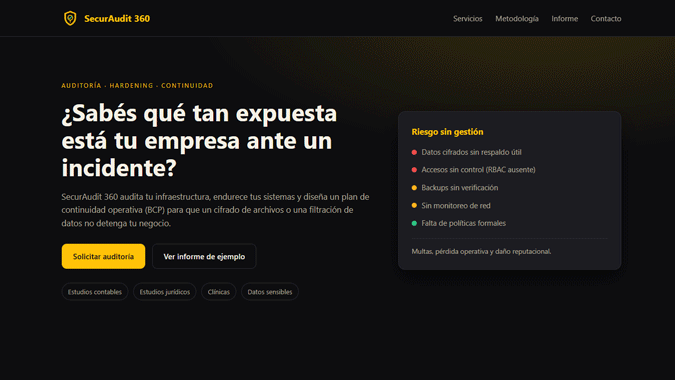
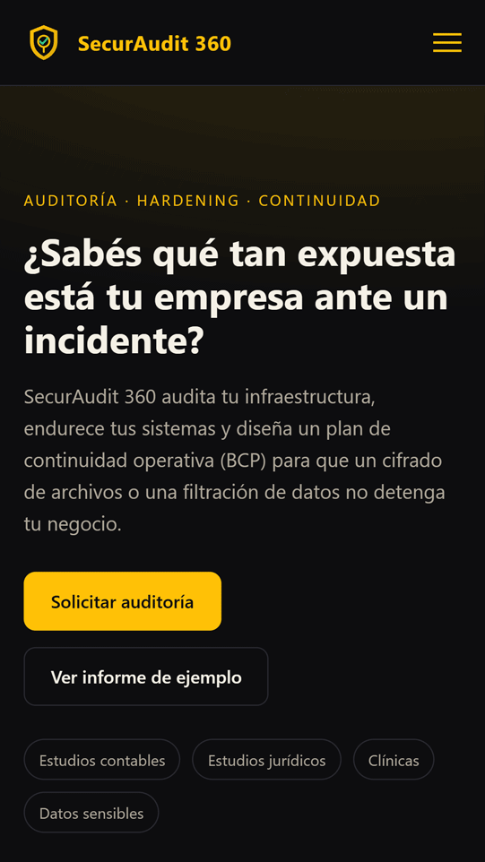

# SecurAudit 360

**SecurAudit 360** is a comprehensive perimeter security auditing, hardening policy, and business continuity planning (BCP/DRP) framework designed for enterprise environments and SMBs handling sensitive information. Specifically engineered for IT consultants, systems administrators, and technology directors, *SecurAudit 360* eliminates operational ambiguity and replaces reactive measures with quantifiable diagnostics, granular access controls, and validated resilience strategies.

Featuring automated scanning tools for Linux and Windows Server, 3-2-1 backup implementations, real-time network anomaly detection, and Role-Based Access Control (RBAC) matrices, the platform enables teams to pinpoint critical ransomware exposure vectors, ensure regulatory compliance, and deploy remediation roadmaps prioritized by business impact.

---

### 📸 Screenshots

<div align="center">
  <table border="0">
    <thead>
      <tr>
        <th align="center">Desktop Version</th>
        <th align="center">Mobile Version</th>
      </tr>
    </thead>
    <tbody>
      <tr>
        <td align="center" valign="middle">
          
        </td>
        <td align="center" valign="middle">
          
        </td>
      </tr>
    </tbody>
  </table>
</div>

---

## ✨ Key Features

* **Multi-Language Support (i18n):** Fully localized interface supporting 3 languages: English, Spanish, and Portuguese, ensuring seamless operation for distributed cybersecurity teams.

* **Adaptive Theming (Dark & Light Mode):** Dynamic UI theme switching supporting both Dark and Light modes, optimized for high-contrast viewing in Security Operations Centers (SOC) as well as bright office environments.

* **Automated Vulnerability Diagnostics:** Dependency-free audit script evaluating open ports, privileged accounts, SSH configurations, system file permissions, and pending security patches.

* **Encrypted 3-2-1 Backup Strategy:** Automated Bash engine featuring Zstandard (`zstd`) compression, end-to-end encryption via OpenSSL (AES-256-CBC), cryptographic SHA-256 integrity verification, and immutable offsite replication (`rsync`).

* **RBAC Access Control Matrix:** Standardized Principle of Least Privilege (PoLP) and segregation-of-duties schema for users, operators, developers, and auditors, preventing lateral movement across corporate assets.

* **Perimeter Monitoring & Anomaly Detection:** Real-time log parser that identifies brute-force attacks against exposed services and automatically applies proactive firewall blocking rules.

* **Multi-Platform Hardening Checklist:** Step-by-step technical implementation guide for OS kernel, networking, and service hardening across Linux distributions (Debian/RHEL) and Windows Server.

* **Business Continuity Planning (BCP) Reporting:** Executive template featuring a prioritized findings matrix (High, Medium, Low), quantified operational risk impacts, and a three-phase remediation roadmap.

---

## ⚙️ What It Does (Available Modules)

From initial assessment to proactive remediation and governance, *SecurAudit 360* deploys the following core components:

1. **Local Audit Scanner (`scripts/linux_audit_scanner.sh`):** Executes rigorous audits against root accounts, high-risk permissions (`/etc/shadow`, `/etc/sudoers`), listening sockets, active firewall configurations, and binaries with SUID/SGID bits set.

2. **Web Dashboard & UI Theming Layer:** Responsive monitoring front-end providing seamless localization across 3 languages (English, Spanish, Portuguese) alongside dynamic Dark/Light theme toggles.

3. **3-2-1 Backup Orchestrator (`scripts/backup_321_engine.sh`):** Archives sensitive directories, compresses payloads, applies dedicated key encryption, verifies SHA-256 checksums, replicates archives to an isolated remote host, and enforces retention lifecycle policies.

4. **Anomaly & Intrusion Detector (`scripts/network_anomaly_detector.sh`):** Scans system authentication logs for adversarial access attempts and injects real-time preventive rules into local firewalls (UFW/iptables) upon threshold breaches.

5. **Privilege Matrix & Governance (`policies/rbac_access_matrix.md`):** Formally defines access levels across shell consoles, database instances, and audit logs according to assigned operational responsibilities.

6. **Audit Report Template (`audit/audit_report_sample.md`):** Executive delivery document designed for management and external auditors detailing identified vulnerabilities, operational risk ratings, and mitigation milestones.

---

## 🛠️ Tech Stack

* **Operating Systems:** Linux (Debian 12 / RHEL 9) and Windows Server hardening baselines.
* **Frontend & Theming:** Semantic HTML5, CSS3 with responsive Dark and Light theme variables, and client-side JavaScript.
* **Internationalization:** Multi-language catalog support (English, Spanish, Portuguese).
* **Cryptography & Networking:** OpenSSL (AES-256-CBC), OpenSSH, UFW, Iptables, Rsync.
* **Automation & Scripting:** Enterprise Bash (`set -Eeuo pipefail` standard), GNU Coreutils, `zstd`.
* **Standards & Compliance Frameworks:** CIS Benchmarks, ISO/IEC 27001, NIST Cybersecurity Framework.

---

## 🚀 Installation and Usage

1. Clone the repository onto the target server:
   ```bash
   git clone [https://github.com/yurialexanderpagelkruger/securaudit-360-framework.git](https://github.com/yurialexanderpagelkruger/securaudit-360-framework.git)
   cd securaudit-360-framework

## 👨‍💻 Author

Developed by **Yuri Alexander Pagel Krüger**